# ERD — Clicon E-Commerce Database

Diagrami Entity-Relationship i bazës relacionale (MySQL).
Gjeneruar nga `backend/prisma/schema.prisma`. Gjithsej **28 tabela**.

> Diagrami renderohet automatikisht në GitHub.

```mermaid
erDiagram
    User {
        int id PK
        string first_name
        string last_name
        string email
        string password_hash
        string phone
        string avatar_url
        bool is_active
        datetime email_verified_at
        int created_by
        int updated_by
        datetime created_at
        datetime updated_at
    }
    Role {
        int id PK
        string name
        string description
        datetime created_at
    }
    UserRole {
        int id PK
        int user_id FK
        int role_id FK
        datetime assigned_at
    }
    Permission {
        int id PK
        string name
        string description
    }
    RolePermission {
        int id PK
        int role_id FK
        int permission_id FK
    }
    RefreshToken {
        int id PK
        int user_id FK
        string token_hash
        datetime expires_at
        datetime revoked_at
        datetime created_at
    }
    AuditLog {
        int id PK
        int user_id FK
        string action
        string entity
        int entity_id FK
        json old_value
        json new_value
        string ip_address
        datetime created_at
    }
    Notification {
        int id PK
        int user_id FK
        string type
        string title
        string message
        bool is_read
        datetime created_at
    }
    Setting {
        int id PK
        string key_name
        string value
        string description
        datetime updated_at
    }
    File {
        int id PK
        string entity
        int entity_id FK
        string filename
        string file_path
        int file_size
        int uploaded_by
        datetime created_at
    }
    SocialAccount {
        int id PK
        int user_id FK
        string provider
        string provider_id FK
        string access_token
        datetime created_at
    }
    Category {
        int id PK
        int parent_id FK
        string name
        string slug
        string icon_url
        int sort_order
        bool is_active
        int created_by
        int updated_by
        datetime created_at
        datetime updated_at
    }
    Brand {
        int id PK
        string name
        string slug
        string logo_url
        bool is_active
        int created_by
        int updated_by
        datetime created_at
        datetime updated_at
    }
    Product {
        int id PK
        int category_id FK
        int brand_id FK
        string name
        string slug
        string description
        string short_description
        decimal price
        decimal compare_price
        int stock_qty
        string sku
        bool is_active
        bool is_featured
        decimal avg_rating
        int review_count
        int created_by
        int updated_by
        datetime created_at
        datetime updated_at
    }
    ProductImage {
        int id PK
        int product_id FK
        string image_url
        int sort_order
        bool is_primary
    }
    ProductVariant {
        int id PK
        int product_id FK
        string variant_type
        string variant_value
        decimal price_adj
        int stock_qty
        string sku
    }
    Tag {
        int id PK
        string name
        string slug
    }
    ProductTag {
        int id PK
        int product_id FK
        int tag_id FK
    }
    Review {
        int id PK
        int product_id FK
        int user_id FK
        int rating
        string comment
        bool is_approved
        int created_by
        int updated_by
        datetime created_at
        datetime updated_at
    }
    Wishlist {
        int id PK
        int user_id FK
        int product_id FK
        datetime created_at
    }
    CompareItem {
        int id PK
        int user_id FK
        int product_id FK
        datetime created_at
    }
    Cart {
        int id PK
        int user_id FK
        datetime created_at
        datetime updated_at
    }
    CartItem {
        int id PK
        int cart_id FK
        int product_id FK
        int variant_id FK
        int quantity
    }
    Address {
        int id PK
        int user_id FK
        string label
        string full_name
        string phone
        string street
        string city
        string state
        string zip_code
        string country
        bool is_default
        int created_by
        int updated_by
        datetime created_at
        datetime updated_at
    }
    Order {
        int id PK
        int user_id FK
        string order_number
        string status
        decimal subtotal
        decimal shipping_cost
        decimal discount
        decimal tax
        decimal total
        int shipping_address_id FK
        int billing_address_id FK
        string payment_method
        string payment_status
        string tracking_number
        string carrier
        datetime estimated_delivery
        string notes
        int created_by
        int updated_by
        datetime created_at
        datetime updated_at
    }
    OrderItem {
        int id PK
        int order_id FK
        int product_id FK
        int variant_id FK
        string product_name
        string variant_info
        int quantity
        decimal unit_price
        decimal total_price
        datetime created_at
    }
    Payment {
        int id PK
        int order_id FK
        string gateway
        string transaction_id FK
        string method
        string status
        decimal amount
        string currency
        string error_message
        int created_by
        int updated_by
        datetime created_at
        datetime updated_at
    }
    Coupon {
        int id PK
        string code
        string type
        decimal value
        decimal min_order
        int usage_limit
        int times_used
        bool is_active
        datetime starts_at
        datetime expires_at
        int created_by
        int updated_by
        datetime created_at
        datetime updated_at
    }
    User ||--o{ UserRole : "has"
    Role ||--o{ UserRole : "has"
    Role ||--o{ RolePermission : "has"
    Permission ||--o{ RolePermission : "has"
    User ||--o{ RefreshToken : "has"
    User ||--o{ AuditLog : "has"
    User ||--o{ Notification : "has"
    User ||--o{ SocialAccount : "has"
    Category ||--o{ Product : "has"
    Brand ||--o{ Product : "has"
    Product ||--o{ ProductImage : "has"
    Product ||--o{ ProductVariant : "has"
    Product ||--o{ ProductTag : "has"
    Tag ||--o{ ProductTag : "has"
    Product ||--o{ Review : "has"
    User ||--o{ Review : "has"
    User ||--o{ Wishlist : "has"
    Product ||--o{ Wishlist : "has"
    User ||--o{ CompareItem : "has"
    Product ||--o{ CompareItem : "has"
    User ||--o{ Cart : "has"
    Cart ||--o{ CartItem : "has"
    Product ||--o{ CartItem : "has"
    ProductVariant ||--o{ CartItem : "has"
    User ||--o{ Address : "has"
    User ||--o{ Order : "has"
    Order ||--o{ OrderItem : "has"
    Product ||--o{ OrderItem : "has"
    ProductVariant ||--o{ OrderItem : "has"
    Order ||--o{ Payment : "has"
```

